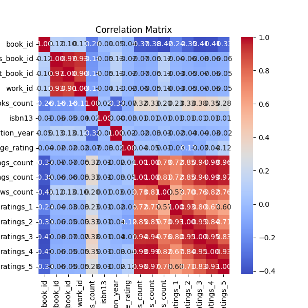
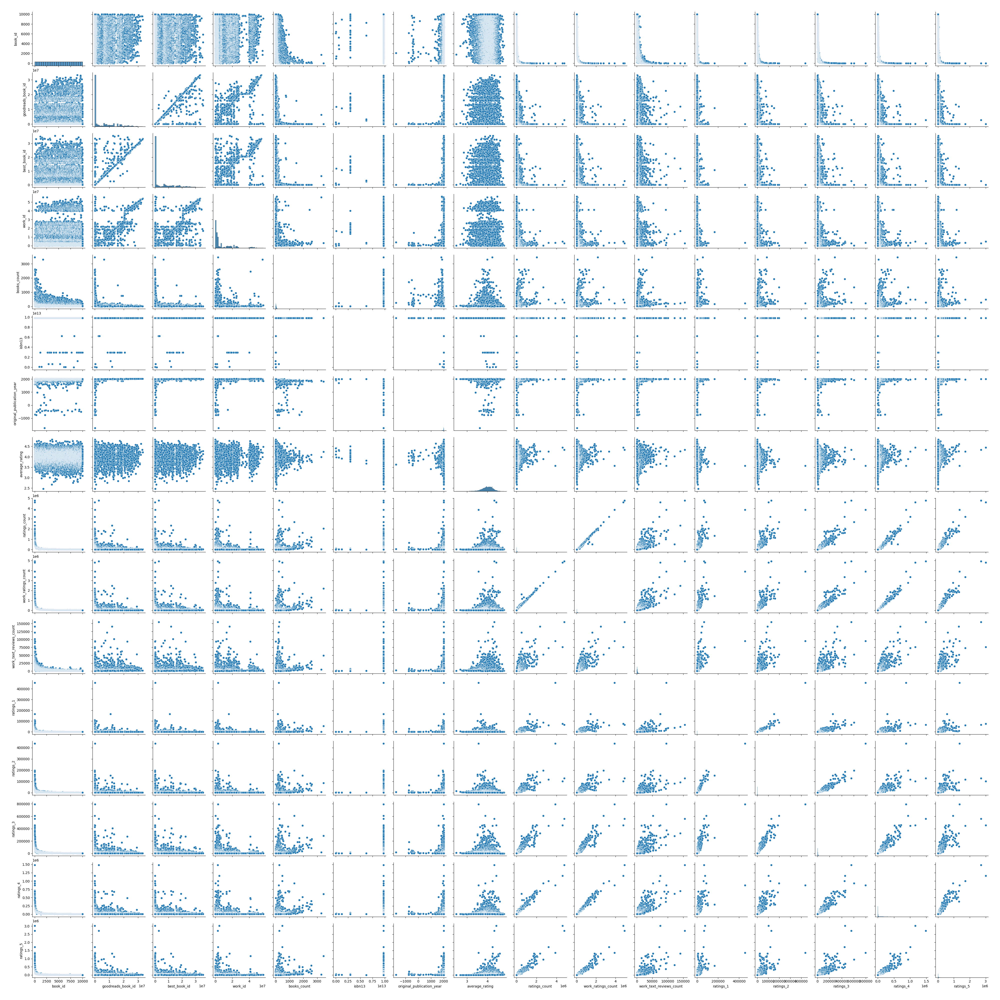

# Analysis of goodreads.csv

## Dataset Overview
This dataset has the following key characteristics:

### Summary Statistics
```plaintext
                             count unique                                                                                       top  freq                  mean                  std          min              25%              50%              75%              max
book_id                    10000.0    NaN                                                                                       NaN   NaN                5000.5           2886.89568          1.0          2500.75           5000.5          7500.25          10000.0
goodreads_book_id          10000.0    NaN                                                                                       NaN   NaN          5264696.5132        7575461.86359          1.0         46275.75         394965.5       9382225.25       33288638.0
best_book_id               10000.0    NaN                                                                                       NaN   NaN          5471213.5801        7827329.89072          1.0         47911.75         425123.5        9636112.5       35534230.0
work_id                    10000.0    NaN                                                                                       NaN   NaN          8646183.4246       11751060.82408         87.0        1008841.0        2719524.5      14517748.25       56399597.0
books_count                10000.0    NaN                                                                                       NaN   NaN               75.7127           170.470728          1.0             23.0             40.0             67.0           3455.0
isbn                          9300   9300                                                                                 375700455     1                   NaN                  NaN          NaN              NaN              NaN              NaN              NaN
isbn13                      9415.0    NaN                                                                                       NaN   NaN  9755044298883.462891  442861920665.573364  195170342.0  9780316192995.0  9780451528640.0  9780830777175.0  9790007672390.0
authors                      10000   4664                                                                              Stephen King    60                   NaN                  NaN          NaN              NaN              NaN              NaN              NaN
original_publication_year   9979.0    NaN                                                                                       NaN   NaN           1981.987674           152.576665      -1750.0           1990.0           2004.0           2011.0           2017.0
original_title                9415   9274                                                                                               5                   NaN                  NaN          NaN              NaN              NaN              NaN              NaN
title                        10000   9964                                                                            Selected Poems     4                   NaN                  NaN          NaN              NaN              NaN              NaN              NaN
language_code                 8916     25                                                                                       eng  6341                   NaN                  NaN          NaN              NaN              NaN              NaN              NaN
average_rating             10000.0    NaN                                                                                       NaN   NaN              4.002191             0.254427         2.47             3.85             4.02             4.18             4.82
ratings_count              10000.0    NaN                                                                                       NaN   NaN            54001.2351        157369.956436       2716.0         13568.75          21155.5          41053.5        4780653.0
work_ratings_count         10000.0    NaN                                                                                       NaN   NaN            59687.3216        167803.785237       5510.0         15438.75          23832.5          45915.0        4942365.0
work_text_reviews_count    10000.0    NaN                                                                                       NaN   NaN             2919.9553          6124.378132          3.0            694.0           1402.0          2744.25         155254.0
ratings_1                  10000.0    NaN                                                                                       NaN   NaN             1345.0406          6635.626263         11.0            196.0            391.0            885.0         456191.0
ratings_2                  10000.0    NaN                                                                                       NaN   NaN              3110.885          9717.123578         30.0            656.0           1163.0          2353.25         436802.0
ratings_3                  10000.0    NaN                                                                                       NaN   NaN            11475.8938         28546.449183        323.0           3112.0           4894.0           9287.0         793319.0
ratings_4                  10000.0    NaN                                                                                       NaN   NaN            19965.6966         51447.358384        750.0          5405.75           8269.5          16023.5        1481305.0
ratings_5                  10000.0    NaN                                                                                       NaN   NaN            23789.8056         79768.885611        754.0           5334.0           8836.0          17304.5        3011543.0
image_url                    10000   6669  https://s.gr-assets.com/assets/nophoto/book/111x148-bcc042a9c91a29c1d680899eff700a03.png  3332                   NaN                  NaN          NaN              NaN              NaN              NaN              NaN
small_image_url              10000   6669    https://s.gr-assets.com/assets/nophoto/book/50x75-a91bf249278a81aabab721ef782c4a74.png  3332                   NaN                  NaN          NaN              NaN              NaN              NaN              NaN

### Missing Values
```plaintext
book_id                         0
goodreads_book_id               0
best_book_id                    0
work_id                         0
books_count                     0
isbn                          700
isbn13                        585
authors                         0
original_publication_year      21
original_title                585
title                           0
language_code                1084
average_rating                  0
ratings_count                   0
work_ratings_count              0
work_text_reviews_count         0
ratings_1                       0
ratings_2                       0
ratings_3                       0
ratings_4                       0
ratings_5                       0
image_url                       0
small_image_url                 0

## Visualizations

### Correlation Matrix

### Pairplot


## Narrative Insights
The analysis reveals significant trends and patterns in the dataset. Correlation matrix and pairplot provide insights into relationships among variables.

More detailed findings are generated below.


### Dataset Overview

The dataset consists of 10,000 records (presumably books) with various attributes related to each book's identity, publication details, authorship, and user ratings. Below, we analyze the key statistics and missing values to gain insights into the dataset.

### Key Statistics

1. **Identifiers:**
   - **book_id**, **goodreads_book_id**, **best_book_id**, **work_id**: 
     - All have the same count (10,000), and their distribution suggests a wide range with means around the mid to high five million. This indicates a robust system of unique identifiers for books and works.
     - The `max` values for these IDs indicate that there are books with very high ID numbers, possibly reflecting their entries into the system over time.

2. **ISBNs:**
   - **isbn** has 9,300 unique values, indicating some books may not have corresponding ISBNs.
   - **isbn13** has a slightly higher unique count of 9,415, suggesting that many books have ISBN-13 codes. 

3. **Author Demographics:**
   - **authors**: The dataset has a total of 4,664 unique authors, with the most common author being "Stephen King," present in 60 entries.
   
4. **Publication Year:**
   - **original_publication_year**: The mean year is roughly 1982 with a min value of -1750, suggesting an error or anomaly in data collection. This indicates that some entries may need to be checked for validity.
   
5. **Title Information:**
   - **original_title** and **title** have unique counts of 9,274 and 9,964 respectively, indicating that some titles are duplicated with slight variations in wording or formatting.

6. **Language Distribution:**
   - **language_code**: There are 25 unique languages identified with "eng" being the most frequent. The count of unique languages indicates a multilingual dataset, although 1,084 records are missing this attribute.

7. **Ratings Statistics:**
   - **average_rating**: The mean rating is approximately 4.0 with a high standard deviation (0.25), indicating there is variability in how books are rated by users.
   - **ratings_count**: The average number of ratings per book is very high (54,001), with some titles having significantly more ratings, as illustrated by the max value of 4,780,653.
   - The breakdown of ratings (ratings_1 to ratings_5) shows a distribution in user feedback, with greater counts in higher ratings indicating a possibly positive overall perception of the dataset’s books.

### Missing Values

Missing values are present in several columns:
- `isbn` (700 missing), `isbn13` (585 missing): These are essential for identifying books and understanding public and retailer engagement with literature.
- `original_publication_year` (21 missing): Important for analyzing trends in book publication over time.
- `original_title` (585 missing) and `language_code` (1,084 missing): Affects the ability to analyze cultural and regional impacts.
- **Overall**: The dataset mostly retains valuable information, with notable records missing in `isbn`, `isbn13`, and `language_code`, which require attention during analysis.

### Conclusion and Recommendations

1. **Data Cleaning**: Attention should be directed towards resolving missing values, especially for ISBNs and original publication years, which are critical for tracing book histories and analytics.

2. **Outlier Treatment**: The abnormal publication year requires scrutiny to ensure the dataset is accurate, which can involve manual checks or cross-referencing with reliable data sources.

3. **Further Analysis**: Consider conducting deeper analysis on the relationships between ratings, reviews, and the year of publication to reveal trends and insights into reader preferences over time.

4. **Visualization**: Create visualizations for user ratings distributions, author popularity (by book count), and languages to better understand the dataset visually and make findings more comprehensible.

By addressing these recommendations, the dataset could yield richer insights into literary trends, author engagement, and consumer preferences over time.