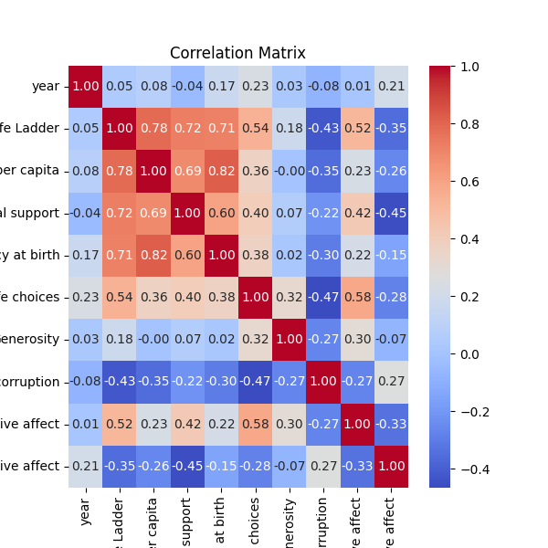
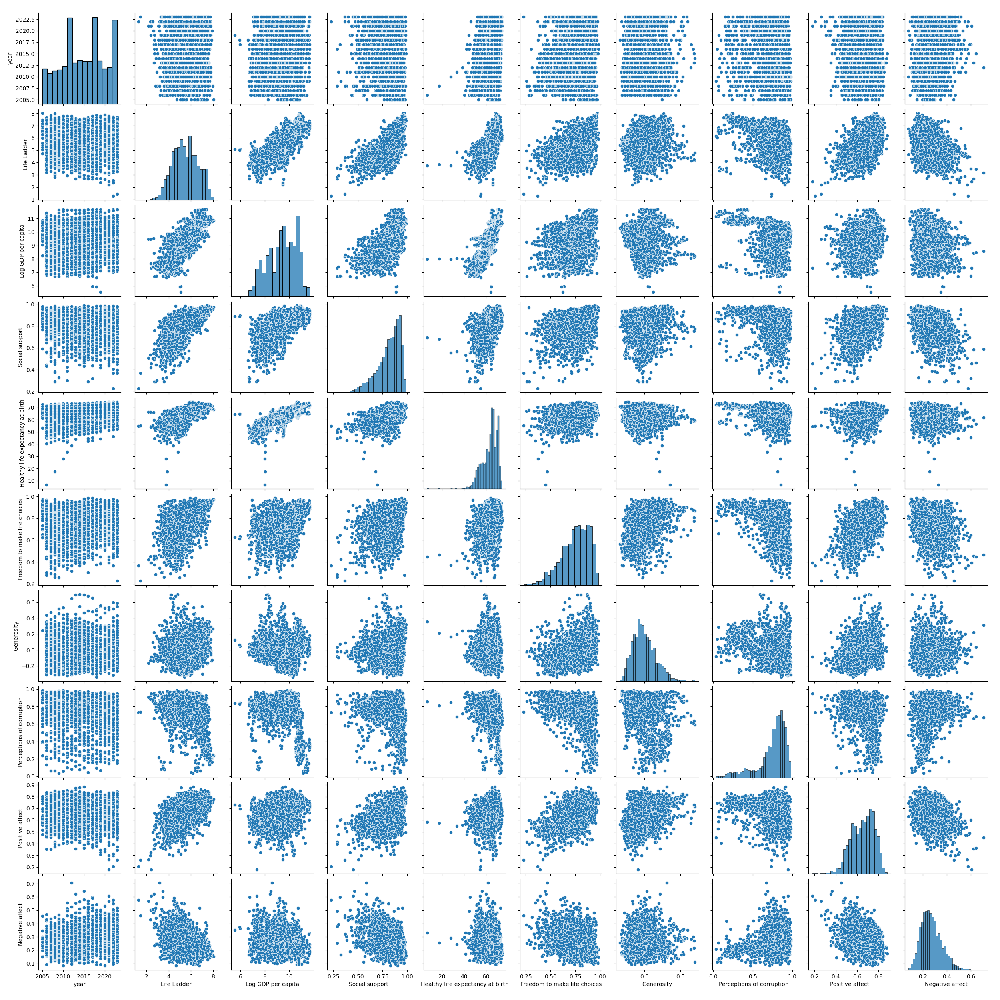

# Analysis of happiness.csv

## Dataset Overview
This dataset has the following key characteristics:

### Summary Statistics
```plaintext
                                   count unique        top freq        mean       std     min     25%     50%      75%     max
Country name                        2363    165  Argentina   18         NaN       NaN     NaN     NaN     NaN      NaN     NaN
year                              2363.0    NaN        NaN  NaN  2014.76386  5.059436  2005.0  2011.0  2015.0   2019.0  2023.0
Life Ladder                       2363.0    NaN        NaN  NaN    5.483566  1.125522   1.281   4.647   5.449   6.3235   8.019
Log GDP per capita                2335.0    NaN        NaN  NaN    9.399671  1.152069   5.527  8.5065   9.503  10.3925  11.676
Social support                    2350.0    NaN        NaN  NaN    0.809369  0.121212   0.228   0.744  0.8345    0.904   0.987
Healthy life expectancy at birth  2300.0    NaN        NaN  NaN   63.401828  6.842644    6.72  59.195    65.1  68.5525    74.6
Freedom to make life choices      2327.0    NaN        NaN  NaN    0.750282  0.139357   0.228   0.661   0.771    0.862   0.985
Generosity                        2282.0    NaN        NaN  NaN    0.000098  0.161388   -0.34  -0.112  -0.022  0.09375     0.7
Perceptions of corruption         2238.0    NaN        NaN  NaN    0.743971  0.184865   0.035   0.687  0.7985  0.86775   0.983
Positive affect                   2339.0    NaN        NaN  NaN    0.651882   0.10624   0.179   0.572   0.663    0.737   0.884
Negative affect                   2347.0    NaN        NaN  NaN    0.273151  0.087131   0.083   0.209   0.262    0.326   0.705

### Missing Values
```plaintext
Country name                          0
year                                  0
Life Ladder                           0
Log GDP per capita                   28
Social support                       13
Healthy life expectancy at birth     63
Freedom to make life choices         36
Generosity                           81
Perceptions of corruption           125
Positive affect                      24
Negative affect                      16

## Visualizations

### Correlation Matrix

### Pairplot


## Narrative Insights
The analysis reveals significant trends and patterns in the dataset. Correlation matrix and pairplot provide insights into relationships among variables.

More detailed findings are generated below.


None