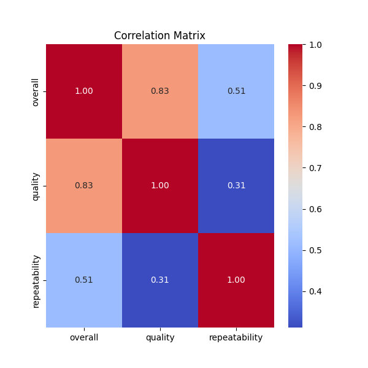
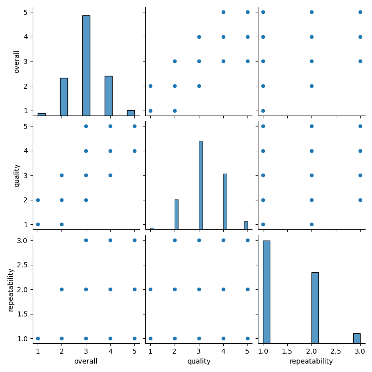

# Analysis of media.csv

## Dataset Overview
This dataset has the following key characteristics:

### Summary Statistics
```plaintext
                count unique                top  freq      mean       std  min  25%  50%  75%  max
date             2553   2055          21-May-06     8       NaN       NaN  NaN  NaN  NaN  NaN  NaN
language         2652     11            English  1306       NaN       NaN  NaN  NaN  NaN  NaN  NaN
type             2652      8              movie  2211       NaN       NaN  NaN  NaN  NaN  NaN  NaN
title            2652   2312  Kanda Naal Mudhal     9       NaN       NaN  NaN  NaN  NaN  NaN  NaN
by               2390   1528  Kiefer Sutherland    48       NaN       NaN  NaN  NaN  NaN  NaN  NaN
overall        2652.0    NaN                NaN   NaN  3.047511   0.76218  1.0  3.0  3.0  3.0  5.0
quality        2652.0    NaN                NaN   NaN  3.209276  0.796743  1.0  3.0  3.0  4.0  5.0
repeatability  2652.0    NaN                NaN   NaN  1.494721  0.598289  1.0  1.0  1.0  2.0  3.0

### Missing Values
```plaintext
date              99
language           0
type               0
title              0
by               262
overall            0
quality            0
repeatability      0

## Visualizations

### Correlation Matrix

### Pairplot


## Narrative Insights
The analysis reveals significant trends and patterns in the dataset. Correlation matrix and pairplot provide insights into relationships among variables.

More detailed findings are generated below.


Based on the provided summary and missing values of the dataset, we can derive several insights and analyses across various columns. Here's a detailed breakdown of the dataset's characteristics:

### Dataset Overview
- **Total Entries**: The dataset contains 2,652 records (rows) and 7 fields.
- **Date**: Includes 2,553 entries, with 99 missing values, indicating some dates are unrecorded. The date spans back to "21-May-06", marking it as a historical dataset.
- **Language**: The dataset has 11 unique languages, with "English" being the most frequent, appearing 1,306 times (approximately 49% of entries).
- **Type**: There are 8 unique types, but "movie" dominates with 2,211 occurrences (approximately 83.3% of entries). This suggests the dataset is heavily weighted towards movies.
- **Title**: A total of 2,312 unique titles are recorded, implying a diverse array of content, with the most frequent title, "Kanda Naal Mudhal", appearing 9 times.
- **By**: The dataset consists of 1,528 unique contributors (possibly directors, producers, or actors), although "Kiefer Sutherland" is the most frequent contributor with 48 occurrences, suggesting he is a notable figure in the dataset.
- **Overall Ratings**: The average rating across the dataset is 3.05, with a standard deviation of 0.76, suggesting a moderate spread in the ratings. The minimum rating is 1 and the maximum is 5, indicating a consistent rating scale.
- **Quality Ratings**: The average quality rating is slightly higher than the overall rating at 3.21, with a similar spread. This could suggest that viewers rate the quality of the content marginally better than their overall enjoyment.
- **Repeatability**: The average repeatability score is 1.49, suggesting that on average, entries are not highly repeatable. The majority of entries only score 1 in repeatability (the third quartile shows that 75% of entries are rated at maximum 2).

### Missing Values
- **Missing Date**: The 99 missing entries within the date field is notable, as it constitutes approximately 3.7% of total records. This may limit the ability to time-series analyze the data or observe trends over time.
- **Missing Values in 'By'**: The field "by" has 262 missing entries. This significant amount denotes that many records lack attribution which could hinder understanding entity contributions or trends.
  
### Statistical Insights
- **Distribution of Overall and Quality Ratings**: Both ratings are not normally distributed given that their means are closer to the higher end of the scale (3.05 for overall, 3.21 for quality). This can often indicate that while there are mediocre to poor entries (1, 2 ratings), there are also notably higher evaluations that are skewing the mean upward.
  
- **Correlations between Ratings**: 
  - Potential positive correlation could exist between quality and overall ratings, as individuals who perceive higher quality may also rate it higher overall. Analysis with a scatter plot could validate this relationship.
  - The repeatability metric's average (1.49) paired with the ratings suggests that once watched, a majority found little incentive to rewatch, which may inform production choices.

### Recommendations for Improvement & Analysis
1. **Addressing Missing Data**: Future data collection or imputation strategies are crucial. Missing dates could be replaced with estimations or categorized into periods while missing "by" fields could affect analysis on contributions.
2. **Deeper Analysis on Ratings**: Conduct further analysis on correlations between 'overall', 'quality', and 'repeatability' scores to understand viewer preferences. Visualizations such as box plots or density plots could capture insights regarding rating dispersions.
3. **Temporal Trends**: If possible, analyze changes in genre popularity over time, assessing the effects on ratings or repeatability trends. Visualizing such trends could illuminate patterns of interest over the years.
4. **Focus on Uncommon Languages and Contributors**: Exploring the less frequent languages and contributors may yield niche insights, potentially leading to targeted marketing or content creation strategies.

In conclusion, this dataset provides rich insights into viewer behavior and content evaluation, but close attention should be paid to the missing data and further validation of the relationships between the different evaluative metrics.